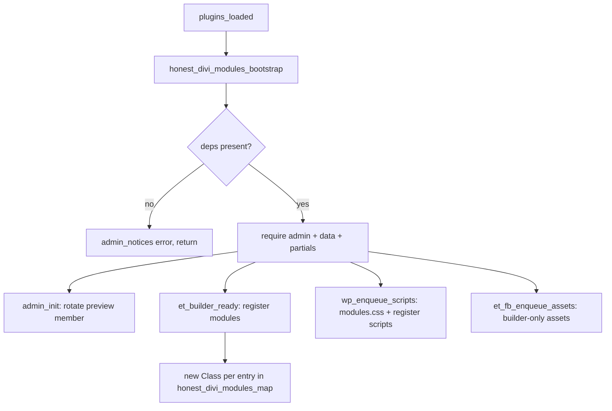

# Honest Divi Modules

Custom Divi Builder modules for the Honest Health site — the Our Team page, the
individual team member pages, and the shared bands (hero, testimonials, call to
action, featured insights) those pages are built from.

- **Repo:** `GustavoGomezPG/honest-health-divi-modules`
- **Installs as:** `wp-content/plugins/honest-divi-modules`
- **Text domain:** `honest-divi-modules`
- **Version:** declared twice, in the plugin header and in
  `HONEST_DIVI_MODULES_VERSION` — CI fails if they disagree

The plugin ships **eight Divi modules** plus the ACF settings screens that feed
them. The modules are thin renderers: nothing about *who appears where* lives in
code, it lives in ACF fields.

---

## Contents

1. [Requirements](#requirements)
2. [What lives in the database, not in this repo](#what-lives-in-the-database-not-in-this-repo)
3. [Repository layout](#repository-layout)
4. [Boot sequence](#boot-sequence)
5. [Module architecture](#module-architecture)
6. [The eight modules](#the-eight-modules)
7. [Content model (ACF)](#content-model-acf)
8. [Data helpers](#data-helpers)
9. [Assets](#assets)
10. [Adding a module](#adding-a-module)
11. [Adding a field](#adding-a-field)
12. [CLI scripts](#cli-scripts)
13. [Backups and restore](#backups-and-restore)
14. [Releasing](#releasing)
15. [Gotchas](#gotchas)

---

## Requirements

| Dependency | Why | How it is detected |
|---|---|---|
| **Divi** — theme, child theme, or the standalone Divi Builder plugin | `ET_Builder_Module`, which every module extends | `honest_divi_modules_has_divi()`, `includes/dependencies.php:30` |
| **ACF *Pro*** (not free ACF) | Options pages and repeater fields are Pro-only | `honest_divi_modules_has_acf_pro()`, `includes/dependencies.php:68` |

Neither is on wordpress.org, so the WP 6.5 `Requires Plugins:` header cannot
express them (it resolves slugs against the .org directory only). Hence the
manual gate in `includes/dependencies.php`.

Detection is layered because of **timing**: plugin files load before the theme,
so `class_exists( 'ET_Builder_Module' )` is `false` at activation even on a
working Divi site. Divi is therefore probed three ways — the runtime
class/constant, then `wp_get_theme()`'s template *and* stylesheet (so a child
theme like `HonestMedic` over `Divi` counts), then any active plugin whose path
contains `divi-builder`.

Behaviour when a dependency is missing:

- **At activation** — `honest_divi_modules_activation_check()` calls
  `deactivate_plugins()` **then** `wp_die()`. That order matters: the activation
  hook fires after WordPress has already recorded the plugin as active, so
  `wp_die()` alone would leave it switched on.
- **After activation** (theme switch, ACF deactivated) — the plugin **no-ops**
  and prints an `admin_notices` error. It deliberately does not self-deactivate;
  silently switching off during a theme switch is harder to diagnose than a
  visible notice.

Nothing is required beyond those two. The plugin has **no build step, no
`package.json`, no Composer, no `node_modules`** — the JavaScript is hand-written
ES5 and only minified in CI.

---

## What lives in the database, not in this repo

Read this before assuming a fresh environment will work. **A clean database with
this plugin active yields a plugin that loads without error and renders
nothing.**

| Thing | Where it actually lives | Recreate with |
|---|---|---|
| The `article-author` post type | ACF Pro's post-type UI, DB record key `post_type_6803de60156dd` | Manual, or restore the DB. `register_post_type` appears **zero times** in this plugin. |
| The `/team/{slug}/` rewrite slug | The same ACF post-type record | `wp eval-file bin/migrate-slug.php` |
| The "Article Authors" ACF field group (`job_title_short`, `bio`, `author_image`, `article_authors`) | Created through the ACF admin UI, DB only, **not version controlled** | Manual, or restore the DB |
| Teams settings (executive roster, markets, quote carousel) | `wp_options`, written by ACF | `wp eval-file bin/seed-team-content.php` |
| The Our Team page layout | `post_content` of the `our-team` page | `wp eval-file bin/seed-team-content.php` |
| The member page Theme Builder template | `et_template` + `et_body_layout` posts | `wp eval-file bin/create-member-template.php` |

There are **no taxonomies** anywhere in this plugin. Member↔market association
is done with ACF relationship fields, not terms.

The plugin owns exactly three member meta keys — `quote`, `why_statement`,
`linkedin_url` (`includes/admin/member-fields.php`). Everything else it reads off
a member is owned by that external, UI-created field group.

---

## Repository layout

```
honest-divi-modules.php          Entry point: constants, bootstrap, module map, asset enqueues
includes/
  dependencies.php               Divi + ACF Pro detection, activation gate, admin notice
  class-honest-divi-module-base.php   Abstract base for all 8 modules
  admin/
    team-settings.php            The "Teams" ACF options pages + 3 option accessors
    member-fields.php            The one PHP-registered ACF group on article-author
    slug-migration.php           Permanent 301 handler for legacy /article-author/ URLs
  data/
    team-data.php                Member/article/segment lookups + builder preview member
  modules/<Name>/<Name>.php      One directory per module, dirname === filename
  partials/                      Shared markup: animation, member card, article card,
                                 card chevron, media placeholder
assets/
  css/modules.css                The only front-end stylesheet (2140 lines)
  css/vb-fields.css              Builder-only: the custom settings-modal control
  css/vb-overrides.css           Builder-only: counter-rules for Divi's prefixed base styles
  js/vb-modules.js               Builder-only: the React mirror of all 8 modules
  js/market-map.js               Lottie playback driver + market tab controller
  js/testimonials.js             Quote carousel
  js/lottie.min.js               Vendored lottie-web 5.12.2, MIT, unmodified
  lottie/market-map.json         The animated US map composition
  lottie/market-map-segments.json  Frame-range manifest that makes it drivable
  img/honest-heart-placeholder.png
bin/                             Three `wp eval-file` scripts (not WP-CLI commands)
docs/backups/                    Snapshots of DB-only layouts + restore instructions
docs/plans/                      The original implementation plan
.github/workflows/release.yml    Package, verify, publish
```

`.gitignore` is two lines — `.DS_Store` and `.superpowers/`. Both are also
excluded from the release zip and asserted absent from it.

---

## Boot sequence

Everything hangs off `plugins_loaded`, deferred so other plugins have declared
themselves before ACF Pro is looked for.



The `require_once` order in `honest_divi_modules_bootstrap()` is **load-bearing**:
`admin/team-settings.php` defines `honest_team_member_post_type()`, which
`admin/member-fields.php` and `data/team-data.php` both call at load time.
Reversing it is a fatal error.

Other hooks:

| Hook | Callback | File |
|---|---|---|
| `acf/init` | `honest_team_register_options_pages` | `admin/team-settings.php:129` |
| `acf/init` | `honest_team_register_fields` | `admin/team-settings.php:294` |
| `acf/init` | `honest_team_register_member_fields` | `admin/member-fields.php:75` |
| `template_redirect` (prio 1) | `honest_team_redirect_legacy_urls` | `admin/slug-migration.php:91` |

Modules are registered by **instantiating** them —
`ET_Builder_Element::__construct()` calls `add_shortcode()`, so `new $class()`
*is* the registration.

### Asset loading

| Handle | Where | Notes |
|---|---|---|
| `honest-divi-modules` (CSS) | Enqueued on every front-end view | The only always-on asset |
| `lottie-web` 5.12.2 | Registered only | Vendored, not CDN — a CDN makes the map depend on an outbound request a CSP or offline env can deny |
| `honest-market-map` | Registered only | Enqueued by `LeadershipByMarket::render()`; depends on `lottie-web` |
| `honest-testimonials` | Registered only | Enqueued by `Testimonials::render()` |
| `honest-divi-vb-modules` (JS) | Builder only | Depends on `jquery` |
| `honest-divi-vb-fields` (CSS) | Builder only | |
| `honest-divi-vb-overrides` (CSS) | Builder only | Depends on `honest-divi-modules` so it can never load first |

The builder path enqueues the three runtime scripts **unconditionally**. It has
to: the `?et_fb=1` document contains no module markup at all (Divi renders
modules into its preview iframe afterwards), so the per-module render-time
enqueue never fires and the map could not run in the builder.

---

## Module architecture

### `Honest_Divi_Module_Base`

`includes/class-honest-divi-module-base.php` — `abstract`, extends
`ET_Builder_Module`. It provides exactly two things a module calls, plus a
private validation pipeline. There is **no `init()`, `get_fields()` or
`render()` in the base**; every module supplies its own.

#### `wrap( $render_slug, $inner, $extra_classes, $css_vars )`

The single wrapper factory, and the reason the base class exists.

Divi builds its module wrapper in React from module type and order, and offers
no supported way to add a class to it. Styling Divi's wrapper server-side works
on the front end and *cannot* work in the builder, so the two contexts would
style different elements. The fix: **the plugin owns one div that both PHP and
the React component emit identically.**

`$vb_support` decides who owns the wrapper, because
`ET_Builder_Element::_render_module_wrapper()` runs only when
`'on' === $vb_support && ! $_is_official_module`, and it emits both an outer and
an inner div:

- **`'on'`** (all eight modules today) — `wrap()` returns one plain
  `<div class="honest-block" style="--hh-x:y;">`. It deliberately does **not**
  call `add_classname()`; doing so would put the block class on Divi's wrapper
  *as well*, and a full-bleed band would paint twice, nested.
- **`'partial'`** (the base default, currently unused) — classes go through
  `add_classname()` / `module_classname()` and the div also carries
  `module_id()`.

#### The CSS custom-property pipeline

Every editable colour is a Divi `color` field written out as an inline
`--hh-*` custom property. The stylesheet only ever reads
`var(--hh-token, <figma-fallback>)` and never hardcodes a value outside a
fallback.

`build_css_var_declarations()` validates every pair and **drops invalid ones
entirely** — never partially — so a bad value cannot smuggle extra CSS into the
style attribute, and the stylesheet fallback renders instead:

| Value shape | Validation | Emitted |
|---|---|---|
| Property name | `/^--[A-Za-z0-9_-]+$/` | — |
| `string` | `is_valid_css_color()` — hex 3/4/6/8, comma-form `rgb()/rgba()/hsl()/hsla()`, or a CSS named keyword. Fully anchored. | `--name:value;` |
| `array( 'url' => … )` | `is_valid_css_url()` — rejects `"`, `\`, CR, LF, then `wp_http_validate_url()` | `--name:url("…");` |
| `array( 'ms' => … )` | numeric, rounded, `0…60000` | `--name:123ms;` |

#### `base_advanced_fields( $selectors, $overrides )`

The only shared field helper. Returns Divi's `fonts` (from the caller's groups),
`background`, `margin_padding`, `borders`, `box_shadow`, and `button => false`.
`$overrides` is merged with `array_merge`, so it replaces groups **wholesale**.

Two naming traps this creates, both load-bearing:

1. **`background_color` and `background_image` are reserved.** Enabling Divi's
   native Background option for every module means a field with either name
   makes Divi write its own competing CSS from the same shortcode attribute.
   Hence `cta_image` and `cta_bg_color`, and `back_bg_color`.
2. **`{$font_group}_text_color` is auto-generated** by Divi's font-group
   builder, and it emits a directly-targeted rule that beats the inherited
   custom property. Every font group in every module therefore passes
   `'hide_text_color' => true`, and the button colour field is
   `button_label_color`, never `button_text_color`.

### The Visual Builder mirror — `assets/js/vb-modules.js`

1002 lines of hand-written ES5 in one IIFE. No JSX, no bundler, no build step —
React and ReactDOM are globals in Divi's preview iframe, so components are plain
`React.createElement` calls.

Two non-obvious facts, both established by inspecting the running builder rather
than from docs:

- **`ET_Builder.API` and the `et_builder_api_ready` event live on the preview
  iframe's window, not the top window.** A script in the top frame sees an empty
  object and the event never fires. This file is enqueued through
  `et_fb_enqueue_assets`, so its `window` is already the iframe.
- Registration happens through **two paths, deduped** by a module-scope
  `registered` flag: the jQuery event (missed if the API came up first) and an
  immediate probe of `window.ET_Builder.API` (finds nothing if it ran first).
  Registering the same slug twice throws.

**The governing rule: no component re-implements markup PHP already owns.**
Anything database-driven — member cards, article cards, the map, the carousel
slides — arrives as server-rendered HTML through a Divi computed property and is
injected as-is. That is the same pattern Divi's own Blog module uses for
`__posts`.

Computed-property sentinels, applied consistently:

| Value | Meaning | Component does |
|---|---|---|
| `''` | PHP rendered nothing | return `null` |
| `false` (from `computedData`) | callback found nothing | return `null` |
| `undefined` | round-trip has not landed yet | **keep rendering the shell** — blanking it makes the module flash out and back on every builder load |

The file also registers one **custom settings-modal field**,
`honest_post_picker` (`registerFields()`), matched to a PHP field's
`'type'`. Divi has no ordered multi-select, and ordering is the point of a
"featured" section. Its value is a pipe-delimited scalar so it round-trips
through the shortcode like any built-in field.

---

## The eight modules

All eight: `extends Honest_Divi_Module_Base`, `$vb_support = 'on'`,
`$main_css_element = '%%order_class%%'`, `advanced_fields` from
`base_advanced_fields()`, and `render()` returning through `wrap()`.

| Directory | Slug | Builder title | Data source | Empty state | Render-time enqueue |
|---|---|---|---|---|---|
| `TextHero` | `honest_text_hero` | Text Hero | props only | omits blank parts | — |
| `ExecutiveLeadership` | `honest_executive_leadership` | Executive Leadership | Teams → Executive Team | returns `''` | — |
| `LeadershipByMarket` | `honest_leadership_by_market` | Leadership by Market | Teams → Markets + Lottie manifest | returns `''` | `honest-market-map` |
| `Testimonials` | `honest_testimonials` | Testimonials | Teams → Quote Carousel | returns `''` | `honest-testimonials` |
| `FeaturedInsights` | `honest_featured_insights` | Featured Insights | `post` query, 4 source modes | returns `''` | — |
| `CallToAction` | `honest_call_to_action` | Call To Action | props only | **always paints** | — |
| `TeamMemberHeader` | `honest_team_member_header` | Team Member Header | current member | returns `''` | — |
| `MemberStatement` | `honest_member_statement` | Member Statement | current member | returns `''` | — |

CSS blocks are `honest-<block>` BEM: `honest-text-hero`, `honest-exec`,
`honest-market`, `honest-testimonials`, `honest-insights`, `honest-cta`,
`honest-member`, `honest-statement`, plus the partials' `honest-member-card`,
`honest-article-card`, `honest-media-placeholder`.

### Notes per module

**TextHero** — pure prop-driven; the React component mirrors it in full, so
edits are instant with no server round-trip. Paints a full-bleed gradient band.
The eyebrow's blue banner is a `::before` on an inner `<span>`, which must
shrink-wrap. Stagger indices only advance for parts that actually render, so a
hero with no eyebrow does not open on a dead beat. Like `CallToAction` it
redirects Design-tab padding at `.honest-text-hero__inner`; the band element
itself carries the breakout's `padding-inline`, so it cannot host the control
without an editor value stranding the copy at viewport width. The stylesheet's
`padding: 80px 0 70px` on `__inner` is the floor and the field default repeats
it — keep the two in step.

**ExecutiveLeadership** — `get_cards_html()` is `static` because Divi invokes
computed callbacks as plain callables with no instance. `__cards` declares a
dependency on `columns` purely to make the property re-fetch at all; the
callback never reads it. Roster edits therefore surface on the next builder
load, not instantly.

**LeadershipByMarket** — an ARIA tablist over the Markets repeater, with the
Lottie map. **Which map segment a market plays is decided by its row position,
not its name** — dragging a row silently repoints it. Speed is validated twice:
by the field's `min_limit`/`max_limit`, and again in `normalize_speed()`, which
*falls back to 3.0* rather than clamping (a value of `0.0001` is `> 0` yet
freezes the map). Market cards get no waypoint animation because three of four
panels are `hidden` at load and the animation would elapse while they were
`display:none`.

**Testimonials** — the carousel *region* is built in React rather than injected
so playback settings stay prop-driven; routing them through AJAX would make
every nudge of a slider wait on a round-trip. Both durations are re-validated in
`render()` and *fall back* (6s / 400ms) rather than clamping. The module paints
no band of its own — the surrounding Divi Section owns the background.

**FeaturedInsights** — the largest module (1019 lines). Four source modes
(`latest`, `manual`, `current_member`, `current_member_custom`), two composited
styles (`member` puts the button in the head row, `feature` drops it below the
grid), and the `%first_name%` heading token. Token handling has three states: a
known name substitutes; a known-*empty* name **drops the whole heading** rather
than leaving "Articles by " dangling; `undefined` leaves the raw token visible
because the round-trip has not landed. Four colour fields deliberately have **no
default** — a default would be emitted inline on every instance and outrank the
stylesheet, so the `style` modifier could never take effect.

**CallToAction** — the odd one out twice over: it has **no computed property**
(its markup is duplicated in `vb-modules.js`, the drift risk the other modules
were written to avoid), and **no empty-state bail** (every field blank still
paints a band). Along with `TextHero` it passes `$overrides` to
`base_advanced_fields()`, redirecting Design-tab padding at
`.honest-cta__inner` — without that, padding lands on Divi's outer wrapper,
*outside* the painted band. `cta_image` is never trusted directly:
`attachment_url_to_postid()` then `wp_get_attachment_image_url()`, so a deleted
attachment or a pasted external URL drops the property and leaves the solid
colour.

**TeamMemberHeader** — reads the member straight off `honest_team_get_member()`;
only the back bar's text and URL are editable. Two inline `currentColor` SVGs so
one colour field drives both text and icon. Bios are authored with single
newlines, so `render_bio()` does
`wpautop( preg_replace( '/\R+/u', "\n\n", esc_html( $bio ) ) )`. The portrait
fallback tests the **rendered HTML**, not `image_id` — a non-zero meta pointing
at a deleted attachment still lands on the placeholder.

**MemberStatement** — three content-driven layout states (both columns / one
alone / nothing) with no setting. The single-column modifier is decided in PHP
rather than with `:only-child` so its 875px cap never reaches the two-column
case. `why` is wysiwyg HTML and is filtered with `wp_kses_post()`, never
`esc_html()`; emptiness is tested after `wp_strip_all_tags()` so a
`<p>&nbsp;</p>` does not paint a labelled banner over nothing.

### Builder stand-in member

`TeamMemberHeader`, `MemberStatement` and FeaturedInsights' `current_member`
source all resolve their member from the post being viewed. Inside Divi's Theme
Builder layout editor there is no such post, so those sections render empty and
the template cannot be laid out.

A real member is substituted **for builder requests only**, via a shared
transient (`honest_team_preview_member`, `DAY_IN_SECONDS`). It must be shared:
the header and the article grid are fetched in *separate* requests, and two
independent draws once produced a heading reading "Articles by Mary" above one
of Greg's articles.

Rotation is event-driven, not time-based — `honest_team_rotate_preview_member()`
on `admin_init`, firing only when `$_GET['page'] === 'et_theme_builder'`. A short
expiry failed both ways: reloading inside the window looked stuck, and an expiry
falling *between* the two requests recreated the mismatch. The previous pick is
excluded so a reload visibly produces somebody new, and members with at least one
credited article are preferred so the grid below is populated too.

**The caller owns the guard.** Every consumer wraps the lookup in
`honest_team_is_builder_render()` — a random member on a live page would be a
data bug, not a preview.

---

## Content model (ACF)

There is **no WordPress Settings API in this plugin**: no `add_menu_page`, no
`register_setting`, no nonces, no `update_option`. The entire "Teams" menu is
ACF Pro options pages, and every read is `get_field( …, 'option' )`.

### Teams screens (`includes/admin/team-settings.php`)

| Menu slug | Screen | Field group | Shape |
|---|---|---|---|
| `honest-teams` | Teams (redirects to the first sub-page) | — | — |
| `honest-teams-executive` | Executive Team | `group_honest_executive_team` | `executive_team_members` — relationship, returns IDs, order = display order |
| `honest-teams-markets` | Markets | `group_honest_markets` | `markets` repeater, max 4 — `market_name`, `market_caption`, `market_members` |
| `honest-teams-carousel` | Quote Carousel | `group_honest_quote_carousel` | `quote_carousel` repeater — `carousel_member`, `carousel_quote` |

All four use capability **`edit_posts`**.

The Quote Carousel is a **curated** set, not "every member with a quote": it
crosses both grids (executives *and* market leaders), and a member's own pull
quote is often not the one wanted in the carousel. Rows whose member is deleted
or unpublished are dropped, as are rows that resolve to no quote at all — an
empty blockquote would still consume a dot and a turn on screen.

Three option accessors live in this file rather than `data/team-data.php`
(historical, nothing enforces the split): `honest_team_get_executive_members()`,
`honest_team_get_carousel_quotes()`, `honest_team_get_markets()`.

### Member fields (`includes/admin/member-fields.php`)

One group, `group_honest_member_details`, on the `article-author` post type:

| Key | Name | Type |
|---|---|---|
| `field_honest_member_quote` | `quote` | textarea |
| `field_honest_member_why` | `why_statement` | wysiwyg (visual only, basic toolbar, no media upload) |
| `field_honest_member_linkedin` | `linkedin_url` | url |

Registered with `acf_add_local_field_group()`, so ACF treats it as **local and
read-only in the admin UI**. There is no `acf-json` sync directory. No field
anywhere in this plugin uses conditional logic.

### Legacy URL redirects (`includes/admin/slug-migration.php`)

Despite the filename this file **migrates nothing**. It is a permanent
`template_redirect` handler that 301s `/article-author/{slug}/` to the member's
real permalink. The migration itself is `bin/migrate-slug.php`.

There is **no completion flag option**. The live state is the flag: the handler
reads the CPT's rewrite slug and stays completely inert unless it is exactly
`team`. That is what makes it safe to deploy the plugin before running the
script — it can never turn indexed URLs into 301s pointing at 404s.

It also resolves the member with `get_page_by_path()` and takes the target from
`get_permalink()`, never a `str_replace()` on the request path. A 301 is
permanently cacheable, so redirecting to a non-existent target teaches every
crawler to keep hitting a dead URL — which naive path rewriting did do, for the
bare archive URL and for any `/article-author/{anything}/`.

**Do not delete this file as "a finished migration."** It is permanently
required; removing it reintroduces 404s on indexed URLs.

---

## Data helpers

`includes/data/team-data.php`:

| Function | Returns |
|---|---|
| `honest_team_get_member( $post_id )` | 9-key array, or `null` unless the post exists, is `article-author`, and is published |
| `honest_team_get_members( $ids )` | The above, order preserved, missing silently dropped |
| `honest_team_get_articles_by_member( $member_id, $limit = 8 )` | `WP_Post[]` |
| `honest_team_get_article_authors( $post_id )` | Members credited on a post |
| `honest_team_map_segment_ranges()` | The Lottie `segments` array, per-request `static` cache |
| `honest_team_get_preview_member_id()` | Builder stand-in member ID |
| `honest_team_pick_preview_member( $exclude = 0 )` | Draws and writes the transient |
| `honest_team_rotate_preview_member()` | Hooked `admin_init` |

The member array is `id`, `name`, `job_title` (`job_title_short`), `bio`,
`quote`, `why` (`why_statement`), `linkedin` (`linkedin_url`), `image_id`
(`author_image`), `permalink`.

**Escaping contract:** `why` is raw wysiwyg HTML — consumers must use
`wp_kses_post()`, never `esc_html()`. Everything else is plain text.

Values are read with `get_post_meta()`, **not** `get_field()` — ACF's return-format
layer is bypassed by design. Cheap and predictable, but a field whose ACF return
format changes will silently change the stored value's meaning.

`honest_team_get_articles_by_member()` is an unindexed
`LIKE '%"123"%'` scan of `wp_postmeta` against the serialized `article_authors`
relationship (the quoted id stops `102` matching `1024`). Fine at this site's
size; it is the first thing to look at if the team pages ever get slow.

Caching is minimal: one per-request `static` for the Lottie manifest and one
`DAY_IN_SECONDS` transient for the preview member. Member, market and article
lookups re-query on every render.

---

## Assets

### `assets/css/modules.css` — the styling contract

2140 lines, the only front-end stylesheet. Its header states five rules; they are
what keeps module colour fields working.

1. **No global declarations.** No `:root`, no bare element selectors. Every
   selector is scoped to a `.honest-*` class the plugin owns.
2. **Defaults live in the `var()` fallback, never in a declaration block.**
   Modules write colours as inline custom properties on their own wrapper and
   descendants inherit them. Declaring `.honest-member-card { --hh-card-bg: … }`
   would make the element's own declaration beat the inherited one and silently
   break every module override. *When adding a token, write
   `var(--hh-thing, <default>)` at the point of use.*
3. **Fallbacks are the Figma value.**
4. **No module owns the page container.** Divi's Row is the container (1240px
   here). Modules render at 100% width; surviving `max-width`s are content
   measures, each commented at its site.
5. **Full-bleed bands break out and come back** with
   `margin-inline: calc(50% - 50vw)` + `padding-inline: calc(50vw - 50%)`. This
   is the only reason a `vw` unit appears in the file.

~60 `--hh-*` tokens, all consumed as `var(--hh-x, <hex>)`. Four `@keyframes`,
all `honest-`-prefixed. Scroll-in reveals reuse Divi's own `et-waypoint` handler
(which adds `et-animated`) but not Divi's `et_pb_animation_*` classes, because
those resolve to per-module generated CSS that does not exist for third-party
modules. Both animation systems have `prefers-reduced-motion` escapes that also
undo Divi's `opacity: 0`, and `@media (scripting: none)` un-hides held cards.

### `assets/css/vb-overrides.css` — why it exists

Divi ships base element styles twice in the same rule: bare (`h1 { … }`) and
builder-prefixed (`.et-db #et-boc .et-l h1 { … }`). On the front end only the
bare branch matches, at (0,0,1), so every single-class `.honest-…` rule wins.
Inside the Theme Builder the preview *is* wrapped in `.et-db #et-boc .et-l`, so
the prefixed branch matches at (1,2,1) and beats `.honest-…` at (0,1,0) —
measured symptom: every heading rendered in the theme's purple, at weight 700
instead of 800, while the front end was correct.

Nothing in CSS lets a lower-specificity rule reclaim a property, and
`!important` would then fight Divi's own Design-tab `!important` output. So the
fix is **restatement at Divi's own prefix**, scoped to only the properties Divi
actually claims (h1–h6 colour/size/weight/line-height + `padding: 0`, and `a`
colour — never `font-family`).

**These declarations duplicate `modules.css` by necessity and must be kept in
step by hand.**

### `assets/js/market-map.js`

Two deliberately separated IIFEs: a playback driver that knows only Lottie, and
a tab controller that knows only DOM.

Driver → `window.HonestMarketMap = { init, showSegment, on, segmentDurationMs }`.
DOM contract on `.honest-market-map`: `data-lottie` (path), `data-segments`
(JSON), `data-speed`. Switching markets **reverses** the displayed segment, then
plays the target forward on `complete`, emitting `reversestart` / `forwardstart`
with `{ index, durationMs }`.

The tab controller times card hand-overs against those events at 0.75 of each
map animation, with a 5s `LOAD_GRACE_MS` fallback — a broken decorative
animation must not be able to hide the actual content. Consequently the panel
swap deliberately **lags** the click by the reversal length, so the panel,
caption and map alt text never describe a region the map is not showing.

Two measured details worth preserving:

- `aria-controls` is resolved with `root.querySelector('[id=…]')`, never
  `document.getElementById` — Divi re-renders reuse ids, and a detached
  controller was observed driving the live panels.
- The `MutationObserver` is coalesced with **`setTimeout`, not
  `requestAnimationFrame`** — rAF never fires in Divi's offscreen preview
  iframe, which latched the queue flag and left the map permanently
  uninitialised in the builder.

### `assets/js/testimonials.js`

Class-only; the crossfade is pure CSS. Reads `data-autoplay` and
`data-slide-duration` off `.honest-testimonials__region`, toggles `is-current`
on slides and `aria-current` on dots (`aria-current`, not `aria-selected` —
that belongs to tab widgets — and removed rather than set to `"false"`).
Autoplay pauses on hover/focus, stops while `document.hidden`, restarts rather
than resumes after a dot click, and is disabled by `prefers-reduced-motion` or a
single slide.

Known open item, flagged in the file header: hover/focus pausing is a
mitigation, **not** the explicit pause/stop/hide control WCAG 2.2.2 asks for.

### Lottie

`market-map.json` (269 KB) is fetched by URL at runtime, never imported.
`market-map-segments.json` is the manifest that makes its single 316-frame
timeline drivable as four market animations:

| Array pos | Name | Frames | States |
|---|---|---|---|
| 0 | West | 0–82 | 11 |
| 1 | Southwest | 88–142 | 4 |
| 2 | Midwest | 148–234 | 12 |
| 3 | East | 240–310 | 8 |

Composition is 1319×814 at 30 fps; the CSS reserves that box so the layout
cannot jump while it loads. The 6 guard frames between segments are never
played — that is what retires one segment's coloured layers before the next
begins, and what makes reversal clean.

**The manifest's `index` is 1-based while `showSegment()` takes the 0-based
array position.** The `states` lists are also the source of the market caption
copy seeded by `bin/seed-team-content.php`.

---

## Adding a module

1. **`includes/modules/<Dir>/<Dir>.php`** — the loader hard-codes
   `includes/modules/{$dir}/{$dir}.php`, so **directory name and file basename
   must match**. `extends Honest_Divi_Module_Base`.
2. **One line in `honest_divi_modules_map()`** — `'<Dir>' => '<Class_Name>',`.
3. **In the class:** `public $slug`; `public $vb_support`; `init()` setting
   `$this->name`, `$this->main_css_element = '%%order_class%%'`,
   `$this->settings_modal_toggles`, and
   `$this->advanced_fields = $this->base_advanced_fields( $fontGroups[, $overrides] )`;
   then `get_fields()` and `render()`, the latter ending in
   `return $this->wrap( $render_slug, $inner, array( 'honest-<block>' ), $css_vars );`
4. **`assets/js/vb-modules.js`** — required if `$vb_support = 'on'`. Push
   `{ slug: '<identical slug>', render: … }` before `API.registerModules( modules )`.
   The component must emit the **same outer div** `wrap()` emits: block class
   plus the same `cssVars({ … })` map. A module at `'on'` with no component here
   cannot draw itself in the builder at all.
5. **`assets/css/modules.css`** — the `honest-<block>` BEM styles and their
   `var(--hh-*, fallback)` defaults. Add to `vb-overrides.css` only if Divi's
   prefixed base styles strip declarations inside the Theme Builder.
6. **Bump `HONEST_DIVI_MODULES_VERSION` and the plugin header** — it is the
   cache-busting `$ver` on every enqueue.
7. **`.github/workflows/release.yml`** — only if you add a new CSS/JS *file*.
   Asset paths are enumerated literally in the minify, verify and zip-assertion
   steps; a file not listed is neither minified nor checked.

You never need to touch `includes/dependencies.php` — it is module-agnostic.

## Adding a field

1. Add it to `get_fields()`; the field name becomes the React prop name verbatim.
2. Consume `$this->props['<name>']` in `render()`.
3. If it is a colour or other custom property, add it to the `$css_vars` array
   passed to `wrap()`. **Invalid values are dropped silently, with no warning
   anywhere** — see the validation table above.
4. Add the matching entry to the component's `cssVars({ … })` in
   `vb-modules.js`, or the builder preview diverges from the front end.
5. Add `var(--hh-token, fallback)` at the point of use in `modules.css`. The
   fallback is what renders whenever validation drops the property.
6. **Avoid the reserved names** `background_color`, `background_image`, and
   `{$font_group}_text_color`.
7. A new *control type* also needs a `registerFields()` entry whose `slug`
   equals the field's `'type'`, plus styles in `vb-fields.css`.
8. A new *computed property* must be `__`-prefixed and consumed through
   `computed()` / `computedData()` following the sentinel convention.

**Colour field names must contain the substring `color`.** Divi's
`process_global_colors()` only resolves `gcid-…` placeholders for props whose key
contains it. A colour field named otherwise would receive a raw `gcid-…` string,
which `is_valid_css_color()` rejects, and the property would be silently dropped.

---

## CLI scripts

`bin/` holds three **standalone `wp eval-file` scripts** — there is no
`WP_CLI::add_command` anywhere in this plugin. They call `WP_CLI::` directly, so
running them any other way fatals immediately.

All three are safe to re-run. Each is hash-guarded against overwriting human
edits, and `force` is the only destructive path.

```bash
# From the WordPress root, with the plugin active.

# 1. Move member URLs to /team/{slug}/ (one-off, idempotent, non-destructive).
#    Sets the ACF post-type rewrite slug and flushes rules. Aborts unchanged on
#    any assertion failure. The 301 handler stays inert until this has run.
wp eval-file wp-content/plugins/honest-divi-modules/bin/migrate-slug.php

# 2. Create/refresh the Divi Theme Builder template for member pages.
wp eval-file wp-content/plugins/honest-divi-modules/bin/create-member-template.php
#    …only to deliberately DISCARD a hand-edited body layout:
wp eval-file wp-content/plugins/honest-divi-modules/bin/create-member-template.php force

# 3. Seed Teams settings, member quotes and the Our Team page layout.
wp eval-file wp-content/plugins/honest-divi-modules/bin/seed-team-content.php
#    …only to deliberately DISCARD the current page/settings/quotes:
wp eval-file wp-content/plugins/honest-divi-modules/bin/seed-team-content.php force
```

`force` is **positional** — WP-CLI rejects unknown `--` flags on `eval-file`
before the file is even included.

**`create-member-template.php`** builds the `et_template` + `et_body_layout` that
renders every member page: back-bar header, featured insights
(`source="current_member"`), and a CTA. The template condition is assembled from
`ET_THEME_BUILDER_SETTING_SEPARATOR` and validated against
`et_theme_builder_get_flat_template_settings_options()` before any write, so a
typo aborts rather than writing an inert row. `_et_default` is forced to `'0'` so
it can never take over the whole site. Content is rewritten only while
`md5(post_content)` still matches `_honest_member_template_hash`; an edited or
unknown-provenance layout is preserved and the hash is deliberately **not**
re-stamped, so the refusal repeats until `force`.

**`seed-team-content.php`** writes the executive roster, the four market rows,
three pull quotes and the six-section Our Team layout. Everything is addressed by
slug or path, never by post ID. Settings are seeded only while empty, quotes only
onto an empty `quote`, and the page only while its hash matches. On a successful
page write it purges Divi's stale caches. Note two of the three seeded quotes are
explicitly **invented placeholder copy**, and market groupings are provisional.

Market rows are written in a load-bearing order — row 0 = West through row 3 =
East — because the Lottie segment is chosen by position.

---

## Backups and restore

`docs/backups/` holds snapshots of content that lives in the **database** and is
therefore covered by no commit. It has already been lost once, when a save
through the Divi UI re-persisted an earlier state and silently discarded a
wp-cli edit.

```bash
# Our Team page (post 20) — byte-exact, because wp reads the file directly
wp post update 20 docs/backups/page-20-our-team-original-content.txt

# Member page body layout (post 109656)
wp post update 109656 docs/backups/body-layout-109656-current.txt

# After ANY scripted edit, refresh the restore point from the database.
# A stale restore point is worse than none.
wp eval 'file_put_contents("wp-content/plugins/honest-divi-modules/docs/backups/body-layout-109656-current.txt", get_post(109656)->post_content);'

# Divi caches per-post CSS, so every scripted edit must be followed by:
rm -rf wp-content/et-cache/*
wp eval 'ET_Core_PageResource::remove_static_resources("all","all");'
```

Two warnings from that README worth repeating: **do not** use
`--post_content="$(cat …)"` — command substitution strips the trailing newline
and the restored content will not match the recorded md5. And without the cache
purge, the layout changes but the page does not.

---

## Releasing

`.github/workflows/release.yml`, one job, `ubuntu-latest`, no secrets beyond the
automatic `GITHUB_TOKEN`.

- **Push a `v*` tag** → builds the zip **and** publishes a GitHub release.
- **`workflow_dispatch`** → builds the zip and attaches it as a workflow
  artifact, publishing nothing. Use it to inspect exactly what would ship.

Steps: read the version from the plugin header → assert it equals
`HONEST_DIVI_MODULES_VERSION` (on *every* trigger; the two drifted fifteen bumps
apart once, and a stale constant serves cached CSS after an update) → assert the
tag minus `v` matches → `php -l` every file → rsync-stage, excluding `.git`,
`.github`, `.gitignore`, `.superpowers`, `docs`, `build`, `.DS_Store` → minify 3
CSS + 3 JS in place with esbuild 0.28.1 (`lottie.min.js` deliberately excluded)
→ verify → zip → assert contents → upload → publish.

The verify step is the interesting one. It runs `node --check` on each minified
JS, then a verifier **written to a file through a quoted heredoc** — not
`node -e`. In the `node -e '…'` form the script is one single-quoted shell word,
so an apostrophe inside it (it shipped with "Text Hero's") ended the quoting and
the release failed with *"//: Is a directory"*. The verifier asserts brace
balance, absence of `/*` (proving the minifier actually ran over each file), ten
load-bearing substrings in `modules.css`, and that `lottie.min.js` came through
byte-identical. The two SVG masks are asserted by their own path data so losing
one cannot be masked by the other, and the keyframes are asserted as
*definitions* because Divi holds `.et-waypoint` elements at `opacity: 0` — a
renamed keyframe leaves content permanently invisible rather than merely
unanimated.

To cut a release:

```bash
# 1. Bump BOTH version facts in honest-divi-modules.php to the same value:
#    the "* Version:" header line and HONEST_DIVI_MODULES_VERSION.
# 2. Commit and push to main.
# 3. Optionally run the workflow manually and download the artifact.
# 4. Tag so that the tag minus "v" equals the header exactly:
git tag v1.56.0 && git push origin v1.56.0
```

The release asset is `honest-divi-modules-<version>.zip`, containing a single
top-level `honest-divi-modules/` directory — installable as-is via
**Plugins → Add New → Upload Plugin**.

---

## Gotchas

Collected from the source comments; most were paid for once already.

**Architecture**

1. A module at `$vb_support = 'on'` **must** ship a React component in
   `vb-modules.js` under the identical slug, or it cannot draw itself in the
   builder.
2. Never emit your own wrapper outside `wrap()` — the `'on'` / `'partial'`
   wrapper-ownership rule is what stops full-bleed bands painting twice.
3. Invalid CSS custom-property values are **dropped silently**. The stylesheet
   fallback renders and nothing is logged. Colours accept hex 3/4/6/8, both the
   comma form and the CSS Color 4 space form of `rgb()`/`hsl()`, and named
   keywords — anything else, including an unresolved `gcid-…` global-colour
   placeholder, is dropped.
4. Divi **backfills a missing toggle definition** for third-party modules:
   `get_toggles()` borrows an existing definition of the same slug from any
   other registered module. Convenient, but it means a module can render
   correctly while depending on another module's declaration — and inherit that
   module's text domain for the toggle title. Declare your own toggles.
5. `vb-overrides.css` duplicates declarations from `modules.css` by necessity.
   Change a value in one and you must change it in the other.
6. Every user-facing string in `vb-modules.js` is hard-coded English. The
   builder API exposes no i18n bridge.

**Content and data**

7. The `article-author` CPT, its `/team/` slug, and the "Article Authors" ACF
   group exist **only in the database**. None survives a DB reset; none is
   version controlled.
8. Market → map-segment binding is **positional**. Reordering the Markets
   repeater silently changes which region animates. The canonical order lives in
   exactly one place, `honest_team_market_segments()`.
9. Never put `<table>`/`<tr>` in an ACF field instruction. ACF counts `<tr>`
   elements inside the repeater wrapper as rows and falsely trips "maximum rows
   reached". Use `<ol>`/`<li>`.
10. `member['why']` is raw wysiwyg HTML — `wp_kses_post()`, never `esc_html()`.
11. The Teams screens are gated on `edit_posts` (Contributor). Any Contributor
    can reorder the executive roster and re-curate the quote carousel. Raise it
    to `edit_pages` / `manage_options` if that is not intended.
12. Bootstrap `require_once` order is load-bearing: `team-settings.php` must
    precede `member-fields.php` and `team-data.php`.
13. Three option accessors live in `admin/team-settings.php`, not
    `data/team-data.php`. Look in both when tracing data flow.
14. `slug-migration.php` is permanent despite its name. Deleting it reintroduces
    404s on indexed URLs.

**Performance**

15. `honest_team_get_articles_by_member()` is an unindexed serialized-meta
    `LIKE` scan, and `honest_team_pick_preview_member()` calls it once per
    member (N+1, ~18 queries at 17 members) on every Theme Builder screen load.
16. `LeadershipByMarket` embeds the entire segment manifest — every frame range
    and state name — into `data-segments` on each instance.
17. `FeaturedInsights` with `show_all = on` and `source = latest` runs
    `posts_per_page => -1` over every published post. Documented in the field
    description; nothing bounds it at runtime.

**Known issues**

18. Duplicate `LeadershipByMarket` / `Testimonials` instances on one page
    collide on ARIA ids **in the builder preview** — each module's computed
    value is fetched in its own AJAX request, so both get the same instance
    counter. The front end is fine.
19. `CallToAction` body copy `#6a8090` on the `#b8c8e7` overlay computes to
    ~2.44:1, short of WCAG AA's 4.5:1. Faithfully reproduced from Figma.
20. `class-honest-divi-module-base.php` references a
    `filter_outer_wrapper_attrs()` method that does not exist anywhere in the
    plugin, and stacks two contradictory docblocks before
    `base_advanced_fields()`. Both are stale comments, not behaviour.

---

## Documentation

- `docs/backups/README.md` — restore procedures and the known-good shape of each
  saved layout.
- `docs/plans/2026-07-28-team-pages.md` — the original 18-task implementation
  plan. Still the best explanation of *why* the architecture is shaped this way,
  but note it predates the shipped code in two respects: it plans seven modules
  (`MemberStatement` was added later) and mandates `vb_support = 'partial'`,
  which every module has since raised to `'on'`.
